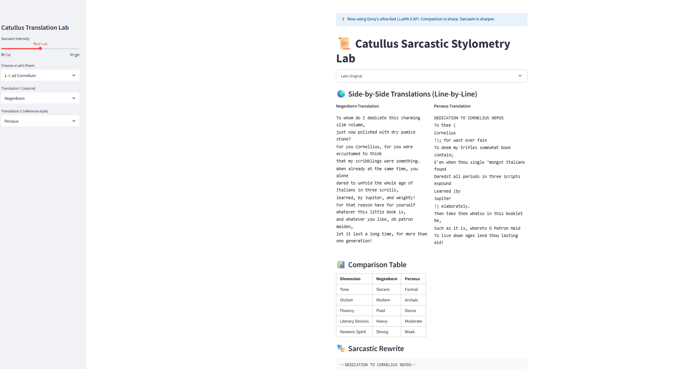

# 📜 Catullus Translation Lab

Welcome to the snarkiest Latin poetry project on GitHub.

This app lets you:
- Explore Catullus' Latin poems 🏛️
- Compare English translations side-by-side 🔍
- Generate sarcastic rewrites with the power of AI 🤖💬

Choose your translation pair, set your sarcasm level, and let LLaMA 3 roast your favorite neoteric verses.

---

## 📚 Why Catullus?

**Gaius Valerius Catullus** (c. 84–54 BCE) was a Roman poet best known for his short, emotionally raw, and often wildly inappropriate poems. A member of the **neoteric movement**, he rejected epic bombast in favor of vivid, personal, and stylistically innovative verse — often attacking rivals or obsessing over his doomed love affair with “Lesbia.”

His work has survived in a single manuscript. Modern translations range from elegant to edgy — and this project was born from a desire to see just how wildly those versions diverge.

> What happens when sarcasm meets scholarship? This app tests that with real-time AI commentary and poetic pastiche.

---

## 🌟 Features

- ✨ Side-by-side line comparison across translators
- 🧠 Style comparison table: Tone, Diction, Fluency, Devices, Neoteric Spirit
- 🧂 Snark slider: Mild → Medium → High
- 🎭 AI-powered sarcastic rewrite in the style of a second translator
- 🚀 Powered by Groq’s ultra-fast LLaMA 3 API

---

## 🛠️ Installation

```bash
git clone https://github.com/JacDo/Catullus-poems.git
cd Catullus-poems
pip install -r requirements.txt
```

---

## 🔐 API Key Setup

To use the Groq API (for sarcasm & comparison), you'll need an API key.

1. Create a file called `.env` in the root of the repo.
2. Paste your key into it like this:

```
GROQ_API_KEY=your_really_long_groq_key_here
```

> ⚠️ Make sure the `.env` file is **NOT committed to GitHub**. It's already excluded via `.gitignore`.

---

## 🚀 Run the App

```bash
streamlit run app/catullus_app.py
```

---

## 📁 Project Structure

```
Catullus-poems/
├── app/
│   └── catullus_app.py            # Streamlit app
├── data/
│   ├── catullus_all_poems.json
│   ├── catullus_combined_translations.json
│   └── translations/
│       ├── catullus_english_perseus.json
│       ├── catullus_english_negenborn.json
│       ├── catullus_english_poetryintranslation.json
│       └── catullus_wikisource_english_all.json
├── scripts/
│   └── webscrape.py               # Collects and formats translation data
├── .env                           # Your API key (excluded from Git)
├── .gitignore
├── requirements.txt
└── README.md                      # You’re reading this
```

---

## 🧠 How It Works

- Translations are loaded from JSON files
- The app uses LLaMA 3 (via Groq’s API) to compare translations and generate sarcastic rewrites
- Prompts are crafted for literary precision and aesthetic judgment — with just the right amount of mockery

---

## 🖼️ Screenshot



## 💌 Credits

Created with literary spite and love by [JacDo](https://github.com/JacDo)  
Inspired by the wit of Gaius Valerius Catullus and the pettiness of the modern internet

---

## 🛑 Disclaimer

This project uses the Groq API to generate outputs. Be mindful of usage limits and rate caps. Never commit your `.env` file!

---
